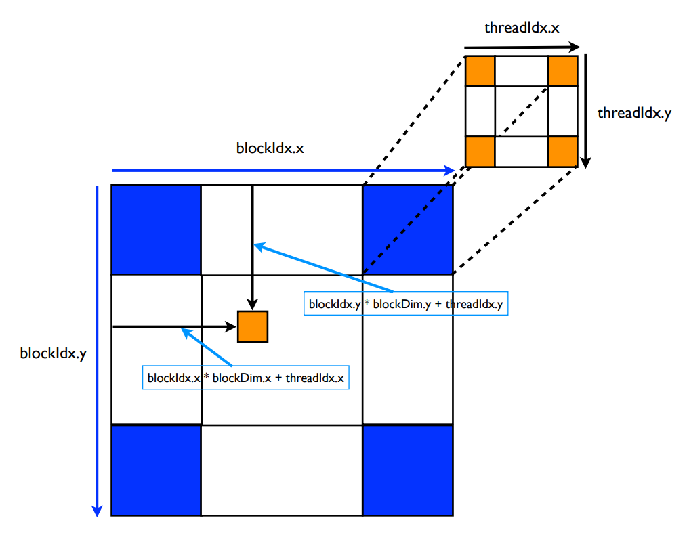

## Compute	Unified	Device Architecture	(CUDA)

CUDA gives each thread a unique ThreadID to distinguish between each other even though the kernel instructions are the same.

Enables GPUs to execute programs written in C in an integrated host (CPU) + device (GPU) manner such that:
* Serial or modestly parallel parts are executed in the host C code.
* Highly parallel parts in device SIMT(Single Instruction Multiple Threads) codes kernel code.

__NOTE:__ `nvcc` wrapper separates out code for the host and device and compiles them into a single executable

### Kernel Calls
* Indicates to the compiler that the code should be run on the device, not the host
```
__global__ void kernel(...) {
// does something
}
```
* The call to the kernel function occurs through the statement: `kernel<<B,T>>(...)` where
  * `B` is a structure that defines the number of blocks in grid in each dimension
  * `T` is a structure that defines the number of threads in a block in each dimension

### Built-in Variables  
* `blockIdx.x`, `blockIdx.y`, `blockIdx.z` returns the block ID in the x-axis, y-axis, and z-axis of the block that is executing the given block of code
* `threadIdx.x`, `threadIdx.y`, `threadIdx.z` return the thread ID in the x-axis, y-axis, and z-axis of the thread that is being executed by this stream processor in this particular block
* `blockDim.x`, `blockDim.y`, `blockDim.z` return the “block dimension” (i.e., the number of threads in a block in the x-axis, y-axis, and z-axis).

__NOTE:__ Number of threads in a block = blockDim.x * blockDim.y * blockDim.z

## NVidia GPU Memory Heirarchy
* Grids map to GPUs
* Blocks map to the MultiProcessors (MP)
* Threads map to Stream Processors (SP)



 __NOTE:__ CUDA devices of compute capability of 1.3 or less can have a maximum of 512 threads per block, while those above 2.0 have up to 1024 threads per block. To keep the code compatible with all CUDA devices, it is better to assume 512 threads per block as the limit.

## Sources
* [CUDA Teaching Center for HPC, Wake Forest University](http://users.wfu.edu/choss/CUDA/)
* [Intro to image processing with CUDA](http://supercomputingblog.com/cuda/intro-to-image-processing-with-cuda/)
